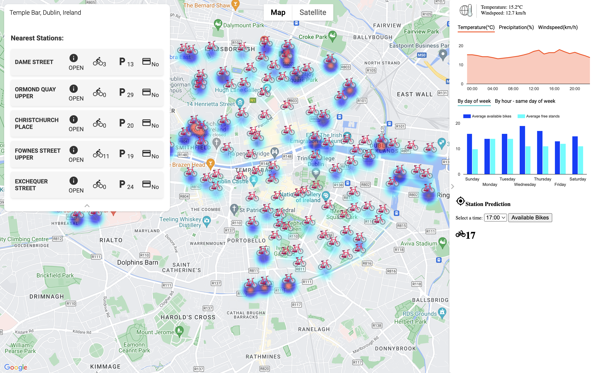

## RideMate version 1.0
This version of RideMate is to develop a web application to display occupance and weather infor mation for [Dublin Bikes](http://www.dublinbikes.ie).

## Introduction
The repository is for the Dublin bikes app. The website had to be shutdown LOW [AWS EC2](https://aws.amazon.com/pm/ec2/) balance
- The project scrapped data from [JCDecauxAPI](https://developer.jcdecaux.com/#/home) and [OpenWeather API](https://openweathermap.org/api) to get data bikes data for 3 months.
- The Scrapper ran in an [AWS EC2](https://aws.amazon.com/pm/ec2/) instance and stored data in an [AWS RDS](https://aws.amazon.com/rds/) ([MySQL](https://www.mysql.com/))
- An ML model was developed with data and deployed on a [Flask](https://flask.palletsprojects.com/en/2.3.x/) instance

### This is Dublin Bikes a webapp for our DBbikes system. 
<!--  -->

<p align="center">
  
</p>

### Features
1. Display bike stations and occupancy information on a map. 
Each bike station is a marker on the map, with its color ranges from clear (no available bike) to light blue (very few available bikes) to darker blue (more available bikes) and to red (many available bikes).
When hovering on the marker (in the shape of bike), user can see some information on the info window.
<p align="center">
  
</p>

2. Show weather and historical availability
When user click on a marker, the information about weather (current and in the next 24 hours) and historical average availability of bikes and bikestands (by day of week and by hour in the same weekday) shows up on the right sidebar.
<p align="center">
  
</p>

3. Predict available bikes
When user choose a time of today or tomorrow, they can get the prediction of available bikes for that time. 
<p align="center">
  
</p>

4. Find 5 nearest stations
When user types in the search box, the search box is auto completed based on Google Places API. 
User can choose their desired location from the dropdown list. 
When five nearest stations to the chosen location are shown, user can click on each options to locate the station and interact with the corresponding marker.
<p align="center">
  
</p>

## Installation
1. Clone the repository to your local machine:

```shell
$ git clone https://github.com/minhlynguyen/ucd-se-ridemate.git
```

2. Navigate to the project directory:

```
$ cd ucd-se-ridemate
```

3. Create a virtual environment and activate it (if applicable):

```
# Using virtualenv
virtualenv venv
source venv/bin/activate

# Using venv (Python 3.6+)
python -m venv venv
source venv/bin/activate
```

4. Install the required dependencies:

```
pip install -r requirements.txt
```

5. Start the development server

```
flask run
```

6. Then open localhost:5000 in your browser to view the webpage

## Contributors

<a href="https://github.com/minhlynguyen"></a>
[Ly M Nguyen](https://github.com/minhlynguyen)

<a href="https://github.com/yuanindublin"></a>
[Yingyuan Li](https://github.com/yuanindublin)

<a href="https://github.com/Fei117117"></a>
[Fei Gao](https://github.com/Fei117117)

## License
MIT License

Copyright (c) 2023 Minh Ly Nguyen

Permission is hereby granted, free of charge, to any person obtaining a copy
of this software and associated documentation files (the "Software"), to deal
in the Software without restriction, including without limitation the rights
to use, copy, modify, merge, publish, distribute, sublicense, and/or sell
copies of the Software, and to permit persons to whom the Software is
furnished to do so, subject to the following conditions:

The above copyright notice and this permission notice shall be included in all
copies or substantial portions of the Software.

THE SOFTWARE IS PROVIDED "AS IS", WITHOUT WARRANTY OF ANY KIND, EXPRESS OR
IMPLIED, INCLUDING BUT NOT LIMITED TO THE WARRANTIES OF MERCHANTABILITY,
FITNESS FOR A PARTICULAR PURPOSE AND NONINFRINGEMENT. IN NO EVENT SHALL THE
AUTHORS OR COPYRIGHT HOLDERS BE LIABLE FOR ANY CLAIM, DAMAGES OR OTHER
LIABILITY, WHETHER IN AN ACTION OF CONTRACT, TORT OR OTHERWISE, ARISING FROM,
OUT OF OR IN CONNECTION WITH THE SOFTWARE OR THE USE OR OTHER DEALINGS IN THE
SOFTWARE.
