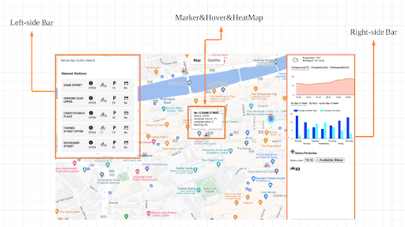

# RideMate version 1.0.
This version of RideMate is the work of a team of 3.
I have plan to make an upgraded version with better UI/UX and more complex features. 

## Introduction
The repository is for the Dublin bikes app. The website had to be shutdown LOW EC2 balance
- The project scrapped data from JCDecaux and open weather API to get data bikes data for 3 months.
- The Scrapper ran in an AWS EC2 instance and stored data in an AWS RDS (MySQL)
- An ML model was developed with data and deployed on a Flask instance

### This is Dublin Bikes a webapp for our DBbikes system. 
<!--  -->

  

### Features
1. Display bike stations and occupancy information on a map. 
Each bike station is a marker on the map, with its color ranges from clear (no available bike) to light blue (very few available bikes) to darker blue (more available bikes) and to red (many available bikes).
When hovering on the marker (in the shape of bike), user can see some information on the info window.

  

2. Show weather and historical availability
When user click on a marker, the information about weather (current and in the next 24 hours) and historical average availability of bikes and bikestands (by day of week and by hour in the same weekday) shows up on the right sidebar.

  

3. Predict available bikes
When user choose a time of today or tomorrow, they can get the prediction of available bikes for that time. 

  

4. Find 5 nearest stations
When user types in the search box, the search box is auto completed based on Google Places API. 
User can choose their desired location from the dropdown list. 
When five nearest stations to the chosen location are shown, user can click on each options to locate the station and interact with the corresponding marker.

  

## Installation
## Usage
## Contributors
## License
